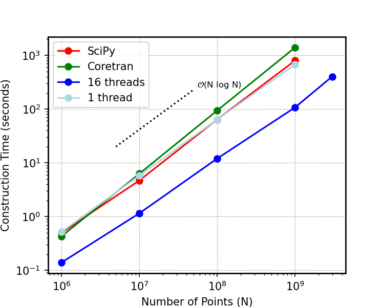
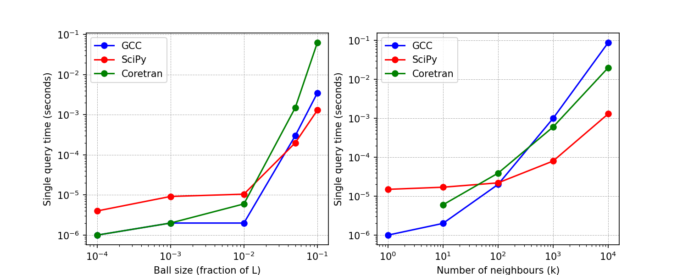

# cosmo_kdtree
Fortran 2003/2008 kd-tree implementation with OpenMP directives for parallel tree construction. Designed for efficient spatial indexing and nearest-neighbour searches in large-scale cosmological simulation data. Optimized for high-performance computing environments, this implementation supports fast querying of particle distributions, enabling scalable analysis of N-body simulations.

Here are some benchmarks and a comparison with other kd-tree implementations. The code is compiled by the GNU Fortran 11.4 compiler and is run on an AMD Ryzen Threadripper Pro 5965WX (24 core) CPU with 256 GB DDR4 of available RAM inside the Ubuntu 22.04 LTS operating system.

